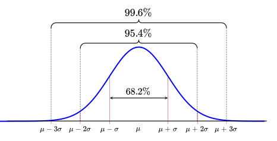
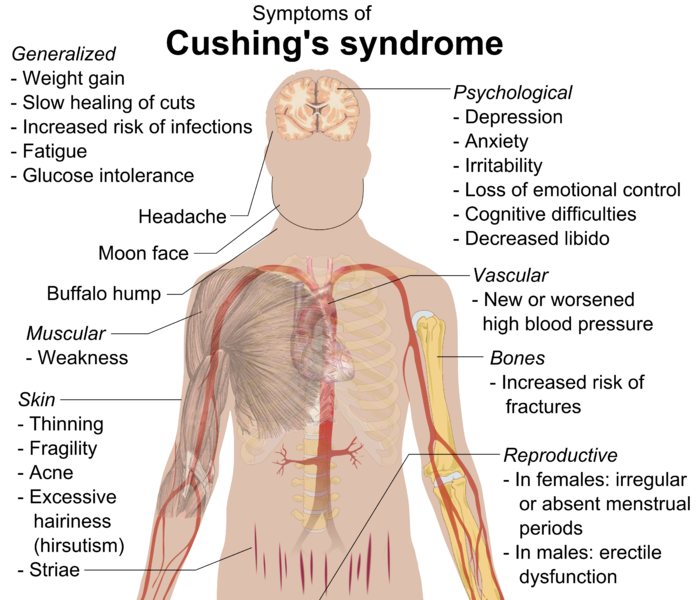

```{r setup, include = FALSE, cache = FALSE, purl = FALSE}
source("assets/xaringan_setup.R")
library(xaringanExtra)
use_tile_view()
use_scribble()
use_search(show_icon = FALSE)
use_progress_bar(color = "#98BF64", location = "bottom", height = "10px")
use_freezeframe()
# use_webcam()
# use_panelset()
# use_extra_styles(hover_code_line = TRUE)

# http://tachyons.io/docs/
# https://roperzh.github.io/tachyons-cheatsheet/
use_tachyons()
source('support_mathmethr.R')
```

```{r libs, echo=FALSE}
library(ggplot2)
theme_set(theme_bw())
library(grid)
library(gridExtra) # to rescale legend
```

## Экономим силы с помощью анализа мощности

  - Тестирование гипотез (двухвыборочный t-критерий)
  - Статистические ошибки при проверке гипотез
  - Мощность статистического теста
  - *A priori* анализ мощности, оценка величины эффекта
  - Как влиять на мощность тестов

### Вы сможете

  - сравнивать средние значения при помощи t-критерия, интерпретировать и описывать результаты
  - дать определение ошибок I и II рода, и графически изобразить их отношение к мощности теста
  - оценивать величину эффекта и необходимый объем выборки по данным пилотного исследования
  - загружать данные из .xlsx в R
  - строить графики средних значений со стандартными отклонениями с помощью `ggplot2`

---

class: middle, center, inverse

# Описательная статистика

---

## С какими данными мы работаем

.pull-left[
.Large[Генеральная совокупность]
]

.pull-right-33[
.Large[Выборка]
]


---

## Как можно судить о свойствах генеральной совокупности по выборке?

__Центральная предельная теорема__ (ЦПТ) говорит, что если мы возьмем достаточно большую выборку из генеральной совокупности, то среднее значение будет нормально распределено с параметрами $\mu_{\bar x}$ и $\sigma _{\bar{x}}$:

$$\bar X \sim N (\mu_{\bar x}, \sigma_{\bar x})$$

При чем $\sigma_{\bar x} = \sigma/\sqrt{n}$.

<br/>

__Важно__: это так при больших объемах выборки ( $N > 30$, или даже $N > 100$), даже если $x$ в генеральной совокупности не подчиняется нормальному распределению.

Мы будем говорить о t-распределении, поскольку на самом деле ничего не знаем о $\sigma _{\bar{x}}$ в генеральной совокупности.  

---

## Характеризуем данные через связки описательных статистик 

.pull-left[
### Центральные тенденции <br/>(Statistics of location)

- Медиана (Median)

- Среднее значение (Mean)]

.pull-right[
### Меры разброса <br/>(Statistics of dispersion)

- Квантили (Quantiles)

- Дисперсия (Variance), <br/>cтандартное отклонение (Standard Deviation)]

---

## Медиана и квантили в R 

Допустим, у нас есть некоторые измерения длины раковины раков-отшельников одного вида. Медиану можно увидеть зрительно, если отсортировать значения по возрастанию.

```{r}
shells <- c(10, 15, 14, 24, 27, 19, 31, 29, 26, 17)
sort(shells)
```

Проверить, правильно ли мы нашли медиану, можно с помощью функции `median()`.

```{r}
median(shells)
```

---

## Квантили 

Квантили бывают разные, в зависимости от того, на сколько частей они разделяют данные. 

- 2-квантиль --- медиана;
- 4-квантиль --- квартили;
- 100-квантиль --- перцентиль. 

---

## Квантили в R

Функция `quantile()` позволяет разделить наши данные на нужное число квантилей (задаются параметром `probs`).

```{r}
quantile(x = shells, probs = c(0.01, 0.25, 0.5, 0.75, 0.99))
```

Можно использовать функцию и без указания значений `probs`, в таком случае функция посчитает *квартили*.

```{r}
quantile(shells)
```

---

## Среднее и стандартное отклонение в R 

Среднее можно расчитать вручную. 

--

```{r}
sum(shells) / length(shells)
```

--

Но есть и специальная функция в R, с помощью которой можно себя проверить.

--

```{r}
mean(shells)
```

---

## Оценка разброса значений

**Девиата** --- между значением вариаты (измерения) и средним:

$$x_i - \bar{x}$$
```{r}
sh_deviates <- shells - mean(shells)
```

Не подходит для средней оценки разброса! 

---

## Сумма квадратов и дисперсия

Избавиться от знака девиаты можно, возведя значение в квадрат. Получим **сумму квадратов (Sum of Squares, SS)**.

$$SS = \sum{{(x_i - \bar{x})}^2} \ne 0$$

```{r results="hide"}
sum(sh_deviates^2)
```

Чтобы получить **дисперсию**, делим `SS` на **число степеней свободы (degrees of freedom)** (n - 1). 

```{r results="hide"}
sum(sh_deviates^2) / (length(shells) - 1)
var(shells)
```

---

## Стандартное/среднеквадратичное отклонение

**Стандартное отклонение** --- корень из дисперсии. Позволит вернуться к исходным единицам измеренния, а также может быть изображено на графике. 

$$s = \sqrt{s^2} = \sqrt{\frac{\sum{(x_i - \bar{x})^2}}{n - 1}} = SD$$

Стандартное отклонение --- это средняя величина отклонения, и ее уже можно изобразить на графике.

```{r}
sqrt(sum(sh_deviates^2) / (length(shells) - 1))
sd(shells)
```

---

## Визуализация описательных статистик

Превращаем рачков-дурачков в датафрейм для визуализации.

```{r}
shells_data <- data.frame(length = shells)
```

.pull-left[

### Медиана и квартили

```{r}
ggplot(data = shells_data) + 
  geom_boxplot(aes(x = 'Медиана \nи квантили', y = length))
```
]

.pull-right[

### Среднее и ст. отклонение

```{r}
ggplot(data = shells_data) + 
  stat_summary(geom = 'pointrange', fun.data = mean_sdl, 
               fun.args = list(mult = 1),
               aes(x = 'Среднее \nи стандартное отклонение', 
                   y = length))
```
]

---

## Особенности применения связок центральные тенденции --- меры разброса

- работают только в связке (медиана --- квантили; среднее --- стандартное отклонение);
- медиана устойчива к выбросам, в отличие от среднего;
- связка "медиана --- квантили" может быть применена к данным с любой формой распределения в отличие от "среднее --- стандартное отклонение".

---

class: middle, center, inverse

# Нормальное распределение

---

## Нормальное распределение

.pull-left-66[
```{r g-norm, echo=FALSE, purl=FALSE}
library(cowplot)
library(ggplot2)
theme_set(theme_bw())
ND_curve <- ggplot(data = data.frame(x = 0:20), aes(x = x)) +
  stat_function(fun = dnorm, args = list(mean = 10, sd = 2), 
                colour = 'red3', size = 1) +
  labs(y = 'Плотность вероятности')
ND_curve
```
]

.pull-right-33[
- симметричное 
- унимодальное
- непрерывное
]

.pull-left-66[
$$f(x) = \cfrac {1}{\sigma \sqrt{2 \pi}} \; e^{- \: \cfrac{(x-\mu)^2}{2\sigma^2}}$$

- $\mu$ --- среднее значение;
- $\sigma$ --- стандартное отклонение.


Это кратко записывается как $x \sim N(\mu, \sigma)$.
]

---

## Вероятности --- это площади под кривой распределения

```{r g-norm-interval, echo=FALSE, purl=FALSE}
ND_curve + 
    stat_function(geom = 'area', fun = dnorm, args = list(mean = 10, sd = 2), 
                  xlim = c(11, 14), alpha = 0.6, fill = 'red3')
```


$-\infty < x < +\infty$.

Площадь под всей кривой $= 1$.

Вероятность встречи значений из определенного промежутка можно узнать, проинтегрировав функцию распределения.

---

## Эмпирическое правило нормального распределения

.center[

]
- 68% значений находятся в пределах 1 стандартного отклонения $\sigma$
- 95% значений --- в пределах 2 $\sigma$
- 99.7% значений --- в пределах 3 $\sigma$ 

---

class: middle, center, inverse

# Тестирование гипотез

---

## Тестирование гипотез: основные принципы

1. Формулировка **нулевой гипотезы** ($H_0$). Обычно это гипотеза об отсутствии разницы или связи между параметрами в генеральной совокупности (например, об отсутствии разницы между средними). 

2. Формулировка **альтернативной гипотезы** ($H_A$) --- гипотезы, являющейся правдивой в случае отвержения $H_0$.

3. Выбор статистического теста для проверки нулевой гипотезы. Одна из популярнейших статистик для проверки гипотезы о разницы в средних --- **t-статистика**.

4. Определение уровня значимости &\alpha& (p-value) для нашей гипотезы. 

---

## t-распределение --- распределение разницы средних для выборок из одной совокупности

t-статистика подчиняется t-распределению.

Иными словами, если много раз взять выборки __из одной__ совокупности (т.е. __при условии, что $H_0$ верна__) и посчитать между ними разницу, то она будет подчиняться t-распределению. 

Форма t-распределения зависит только от одного параметра --- числа степеней свободы $df$

```{r gg-t, echo=FALSE, purl=FALSE, fig.height=5, fig.width=6}
t_df <- data.frame(t = seq(-6, 6, length.out = 1000))

gg_t <- ggplot(data = t_df, aes(x = t)) +
  stat_function(fun = dt, args=list(df=18), size = 3, geom='line', colour='darkred') + 
    labs(x = 't', 
       y = 'Плотность\nвероятности', 
       title = 't-распределение, df = 18') +
  theme(text = element_text(size = 18))

gg_t
```

---

## В хвостах этого распределения находятся редкие значения (__для случая, когда $H_0$ верна__)

```{r gg-tcrit, echo=FALSE, purl=FALSE}
alpha <- 0.05
df <- 18
sides <- 2
p_cut <- abs(qt(p = alpha/sides, df = df))
gg_t + 
  # alpha
  stat_function(fun = dt_limit, 
                args = list(alph = alpha, df = df, sides = sides), 
                geom = 'area', fill = 'red', alpha = 0.7) + 
  stat_function(fun = dt, args=list(df=df), 
                geom = 'line', colour = 'darkred') +
  labs(title = 't-распределение, df = 18, alpha = 0.05') + 
  # редкие
  geom_vline(xintercept = p_cut, size = 1, linetype = 'dotted') +
  geom_vline(xintercept = -p_cut, size = 1, linetype = 'dotted') +
    annotate(geom = 'text', x = -p_cut, y = 0.4, hjust = 1.1, 
           label = '-t и t при alpha 0.05') 
```

Обычно используется уровень значимости $\alpha$ 0.05 или 0.01. 

__Уровень значимости $\alpha$ --- это вероятность ошибочно отвергнуть справедливую нулевую гипотезу__. Т.е. это вероятность найти различия там, где их нет (__вероятность ошибки I рода__).

Для t-теста  $\alpha$ --- это вероятность ошибочно сделать вывод о том, что средние выборок различаются __при условии, что эти выборки получены из одной генеральной совокупности__.

---

## Тест Стьюдента (t-критерий)

Гипотезы: $H_0: \mu_1 - \mu_2 = 0$, $H_A: \mu_1 - \mu_2 \ne 0$  

.pull-left-66[

Двухвыборочный тест Стьюдента (Student, 1908) используется для проверки значимости различий между средними значениями двух величин.

$$t= \frac{\bar{x}_1 - \bar{x}_2}{SE_{\bar{x}_1 - \bar{x}_2}}$$]


.pull-right-33[


.tiny[William Sealy Gosset. Photo: Wikipedia]
]

Условия применимости:

- Наблюдения случайны и независимы друг от друга
- Выборки случайны и независимы друг от друга
- Величины нормально распределены или большая выборка (> 30 наблюдений в группе)
- __Дисперсии в группах одинаковы__

$SE = \sqrt{\frac{s_1^2(n_1-1) +s_2^2(n_2-1)}{n_1+n_2-2}\Big(\frac{1}{n_1} + \frac{1}{n_2}\Big)}$

$df = (n_1 - 1) + (n_2 - 1) = n_1 + n_2 - 2$

---

## t-тест Уэлча (Welch, 1938, 1947) --- это модификация теста Стьюдента __для случая разных дисперсий__

.pull-left-66[


$$t= \frac{\bar{x}_1 - \bar{x}_2}{SE_{\bar{x}_1 - \bar{x}_2}}$$

Условия применимости:

- Наблюдения случайны и независимы друг от друга

- Выборки случайны и независимы друг от друга

- Величины нормально распределены или большая выборка (> 30 наблюдений в группе)
]

.pull-right-33[


.tiny[Bernard Lewis Welch. Photo scanned by GeneralBurgoyne on Reddit] 
]


$SE = \sqrt{{s_1^2}/ {n_1} + {s_2^2}/{n_2}}$

Приблизительное число степеней свободы рассчитывается по уравнению Уэлча-Саттеруэйта 

$$df \approx \cfrac {({s^2_{1}}/{n_{1}} + {s^2_{x_2}}/{n_{2}})^2}
{\frac{1}{n_{1} - 1}\bigg(\frac {s_{1}^2} {n_{1}}\bigg)^2 + \frac{1}{n_{2} - 1}\bigg(\frac {s_{2}^2} {n_{2}}\bigg)^2}$$

---

## Тестирование гипотезы о равенстве двух средних при помощи t-теста

```{r gg-tcrit-h, echo=FALSE, purl=FALSE}
gg_t + 
    # alpha
  stat_function(fun = dt_limit, 
                args = list(alph = alpha, df = df, sides = sides), 
                geom='area', fill='red', alpha = 0.7) + 
  stat_function(fun=dt, args=list(df=df), 
                geom='line', colour='darkred') + 
    labs(title = 't-распределение, df = 18, alpha = 0.05') + 
# Зоны решений
  geom_segment(x=-1.5, xend = -1.5, y=0, yend = 0.2) +
  annotate(geom = 'text', x = -3, y = 0.25,
           label = '|t| < |t_crit| \n Не можем отвергнуть H0') +
  geom_segment(x=2.7, xend = 2.7, y=0, yend = 0.2) +
  annotate(geom = 'text', x = 2.7, y = 0.25, 
           label = '|t| >= |t_crit| \n Отвергаем H0')
```

1. Для конкретных данных считаем значение t-критерия.
2. Сравниваем его с теоретическим распределением t (распределением при условии, что $H_0$ верна).
3. Принимаем решение, отвергнуть ли $H_0$.

---

## Одновыборочный и двухвыборочный t-test

Альтернативная гипотеза может быть сформулирована по-разному. В зависимости от её формулировки приходим к разным вариантам t-теста.

.pull-left[### Односторонний тест
Формулировка $H_A$ имеет некую направленность (например, что средние в одной из групп больше, чем в другой).

```{r echo=FALSE, purl=FALSE}
gg_t + 
    # alpha
  # fun = dt_limit, 
  #               args = list(alph = alpha, df = df, sides = sides,
  #                           ncp = nc, what = 'power'), 
  #               geom = 'area', fill='seagreen2', alpha = 0.7
  stat_function(fun = dt_limit, 
                args = list(alph = 0.05, df = df, 
                            sides = 1, what = "power"), 
                geom='area', fill='red', alpha = 0.7) + 
  #stat_function(fun=dt, args=list(df=df), 
                #geom='line', colour='darkred') + 
    labs(title = 't-распределение, df = 18, alpha = 0.05') + 
  geom_segment(x = 2.7, xend = 2.7, y = 0, yend = 0.2) +
  annotate(geom = 'text', x = 2.7, y = 0.25, 
           label = '|t| >= |t_crit| \n Отвергаем H0')

```

]

.pull-right[### Двухсторонний тест
Формулировка $H_A$ не направлена и говорит о наличии различий/взаимосвязи (например, средние в группах сравнения отличны).

```{r echo=FALSE, purl=FALSE}
gg_t + 
    # alpha
  stat_function(fun = dt_limit, 
                args = list(alph = alpha, df = df, sides = sides), 
                geom='area', fill='red', alpha = 0.7) + 
  #stat_function(fun=dt, args=list(df=df), 
                #geom='line', colour='darkred') + 
    labs(title = 't-распределение, df = 18, alpha = 0.05') + 
  geom_segment(x = 2.7, xend = 2.7, y = 0, yend = 0.2) +
  geom_segment(x = -2.7, xend = -2.7, y = 0, yend = 0.2) +
  annotate(geom = 'text', x = 2.7, y = 0.25, 
           label = '|t| >= |t_crit| \n Отвергаем H0')

```

]

---

## Пример: Гормоны и артериальная гипертензия

Синдром Кушинга --- это нарушения уровня артериального давления и целый комплекс других симптомов, вызванных гиперсекрецией кортизола надпочечниками.

.center[


.tiny[Cushing’s syndrome. Photo: Wikipedia]
]

---

## Пример: Гормоны и артериальная гипертензия

В датасете `Cushings` (пакет `MASS`) записаны данные о секреции двух метаболитов при разных типах синдрома (данные из кн. Aitchison, Dunsmore, 1975).

- `Tetrahydrocortisone` --- секреция тетрагидрокортизона с мочой (мг/сут.)
- `Pregnanetriol` --- секреция прегнантриола с мочой (мг/сут.)
- `Type` --- тип синдрома:
    - `a` --- аденома
    - `b` --- двусторонняя гиперплазия
    - `c` --- карцинома
    - `u` --- не известно

Различается ли секреция тетрагидрокортизона при аденома и двусторонней гиперплазии надпочечников?

```{r}
library(MASS)
data("Cushings")
```

---

## Двухвыборочный t-критерий в R рассчитывает функция `t.test()`

О параметрах функции t.test() можно прочесть в справке `?t.test`

--

Если в данных __ровно две группы__ используется т.наз. "формула".

```
t.test(formula = зависимая_переменная ~ группирующая_переменная, 
       data = датафрейм_с_данными, ...)
```

--

Если __больше двух групп__ 

- можно непосредственно передать их данные в виде векторов,

```
t.test(x = вектор_1_группа, y = вектор_2_группа, ...)
```

--

- либо можно отобрать ровно две группы при помощи аргумента `subset`.

```
t.test(formula = зависимая_переменная ~ группирующая_переменная, 
       data = датафрейм_с_данными, 
       subset = логический_вектор_отбирающий_2_группы,
       ...)
```

---

## Различается ли секреция тетрагидрокортизона при аденома и двусторонней гиперплазии надпочечников?


```{r}
tt <- t.test(formula = Tetrahydrocortisone ~ Type, data = Cushings, 
             subset = Cushings$Type %in% c('a', 'b'))
tt
```

--

Результаты можно описать, например, так:

- Секреция тетрагидрокортизона значимо различается у пациентов с аденомой и двусторонней гиперплазией надпочечников ($t_{`r round(tt$parameter, 2)`} = `r round(tt$statistic, 2)`$, $p = `r format.pval(tt$p.value, eps = 0.05)`$)

---

## Задания 1-3

__Задание 1__

Перепишите вызов функции `t.test()` с использованием другого шаблона вызова (с параметрами `x` и `y`)

__Задание 2__

Как называются отдельные элементы результатов можно узнать посмотрев их структуру при помощи функции `str()`

__Задание 3__

Получите отдельные элементы результатов из объекта `tt` при помощи оператора `$`
  
- значение t-критерия
- число степеней свободы
- уровень значимости

---

## Другой шаблон вызова функции `t.test()`

```{r}
tt <- t.test(x = Cushings$Tetrahydrocortisone[Cushings$Type == 'a'],
             y = Cushings$Tetrahydrocortisone[Cushings$Type == 'b'])
tt

```

---

## Что спрятано в результатах?

Как называются отдельные элементы результатов можно узнать посмотрев их структуру при помощи функции `str()`

```{r}
str(tt)
```

---

## Можно получить элементы результатов в виде отдельных цифр

```{r purl=FALSE}
tt$parameter # степени свободы
tt$p.value # уровень значимости
tt$statistic # значение t-критерия
```

---

class: middle, center, inverse

# Статистические ошибки при проверке гипотез

---

## Типы ошибок при проверке гипотез

| 	|$$H0 == TRUE$$ |	$$H0 == FALSE$$ |
|-----|-----|-----|
| Отклонить $H_0$ 	| Ошибка I рода | 	Верно |
| Сохранить $H_0$ 	| Верно | Ошибка II рода |

---

## Ошибка I рода


| 	|$$H0 == TRUE$$ |	$$H0 == FALSE$$ |
|-----|-----|-----|
| Отклонить $H_0$ 	| Ошибка I рода | 	Верно |
| Сохранить $H_0$ 	| Верно | Ошибка II рода |


```{r power_alpha, echo = FALSE, fig.height=3, fig.width=10.1, purl = FALSE}
gg_alpha <- gg_t + 
  # alpha
  stat_function(fun = dt_limit, 
                args = list(alph = alpha, df = df, sides = sides), 
                geom = 'area', fill = 'red', alpha = 0.7) + 
  # H_0 curve
  stat_function(fun = dt, args=list(df = df), 
                geom = 'line', colour = 'darkred') + 
  # labs
  labs(title = 't-распределение, df = 18, alpha = 0.05') +
  # limits
  geom_vline(xintercept = p_cut, size = 1, linetype = 'dotted') +
  geom_vline(xintercept = -p_cut, size = 1, linetype = 'dotted') +
    annotate(geom = 'text', x = -p_cut, y = 0.4, hjust = 1.1,
           label = '-t и t при alpha 0.05')
gg_alpha
```

__Ошибка I рода --- вероятность отвергнуть $H_0$, когда верна $H_0$__

---

## Мы этого не знаем, но может быть верна $H_A$...


| 	|$$H0 == TRUE$$ |	$$H0 == FALSE$$ |
|-----|-----|-----|
| Отклонить $H_0$ 	| Ошибка I рода | 	Верно |
| Сохранить $H_0$ 	| Верно | Ошибка II рода |


```{r power_alternative, echo = FALSE, fig.height=3, fig.width=10.1, purl = FALSE}
nc <- 1
gg_alpha +
    stat_function(fun = dt, 
                args = list(df = df, ncp = nc), 
                geom = 'line', colour = 'steelblue', size = 1)
```

Можно построить еще одно распределение статистики --- распределение, при условии того, что верна $H_A$.

---

## Ошибка II рода

| 	|$$H0 == TRUE$$ |	$$H0 == FALSE$$ |
|-----|-----|-----|
| Отклонить $H_0$ 	| Ошибка I рода | 	Верно |
| Сохранить $H_0$ 	| Верно | Ошибка II рода |


```{r power_beta, echo = FALSE, fig.height=3, fig.width=10.1, purl = FALSE}
gg_beta <- gg_alpha + 
    # beta
  stat_function(fun = dt_limit, 
                args = list(alph = alpha, df = df, sides = sides,
                            ncp = nc, what = 'beta'), 
                geom = 'area', fill='steelblue', alpha = 0.7) +
# H_A curve
  stat_function(fun = dt, 
                args = list(df = df, ncp = nc), 
                geom = 'line', colour = 'steelblue', size = 1)
gg_beta
```

__Ошибка II рода --- вероятность принять $H_0$, когда верна__ $H_A$

---

## Верные и неверные решения

.pull-left[
**Ошибка I рода: нашли то, чего нет**
]
.pull-right[
**Ошибка II рода: не нашли то, что было**
]

| 	| $H_0$ верна |	$H_0$ неверна |
|:-----:|:-----:|:-----:|
| Отклонить H0 | Ошибка I рода с вероятностью <span class="orange">&alpha;</span></br>Ложно-положительный результат | 	Верно |
| Сохранить H0 | Верно | Ошибка II рода с вероятностью <span class= "blue">&beta;</span> </br> Ложно-отрицательный результат |

---

## Мощность теста --- способность выявлять различия


| 	|$$H0 == TRUE$$ |	$$H0 == FALSE$$ |
|-----|-----|-----|
| Отклонить $H_0$ 	| Ошибка I рода | 	Верно |
| Сохранить $H_0$ 	| Верно | Ошибка II рода |


```{r power-power, echo = FALSE, fig.height=3, fig.width=10.1, purl = FALSE}
gg_power <- gg_beta +
# power
    stat_function(fun = dt_limit, 
                args = list(alph = alpha, df = df, sides = sides,
                            ncp = nc, what = 'power'), 
                geom = 'area', fill='seagreen2', alpha = 0.7) +
# H_A curve
  stat_function(fun = dt, 
                args = list(df = df, ncp = nc), 
                geom = 'line', colour = 'steelblue', size = 1)

gg_power
```

__Мощность теста - вероятность отвергнуть $H_0$, когда верна__ $H_A$: $Power = 1 - \beta$, где $\beta$ --- вероятность ошибки II рода (не найти различия там, где они есть). 

---

## Мощность теста

$$Power = 1 - \beta$$

Обычно считается, что хорошо, когда мощность не меньше 0.8

Т.е. что в 80% случаев мы можем найди различия заданной величины, если они есть.

```{r power-power, echo = FALSE, fig.height=3, fig.width=10.1, purl = FALSE}
```

---

## Анализ мощности

.pull-left[

*A priori*

- какой нужен объем выборки, чтобы найти различия с разумной долей уверенности?
- различия какой величины мы можем найти, если известен объем выборки?
]

.pull-right[

*Post hoc*

- смогли бы мы найти различия при помощи нашего эксперимента $(\alpha$, $n$), если бы величина эффекта была $X$?
]

---

class: middle, center, inverse

# A priory анализ мощности

---

## A priori анализ мощности

.pull-left[

Что нужно

- тест
- уровень значимости
- желаемая мощность теста
- ожидаемая величина эффекта
]

--

.pull-right[
Что есть

- $t$-критерий
- $\alpha = 0.05$
- $Power = 0.8$
- ?
]

---

## Величина эффекта

.pull-left-66[

$d$ Коэна (Cohen's d)


$$d = \frac{\bar x_1 - \bar x_2}{SD_{pooled}}$$

где $SD_{pooled}$ --- обобщенное стандартное отклонение (расчитывается для каждой из групп сравнения).

$$SD_{pooled} = {\sqrt{\frac {(n _1 - 1)s_1^2 + (n _2 - 1)s_2^2 }  {n _1 + n _2 - 2} } }$$
]

.pull-right-33[


.tiny[
Jacob Cohen]

]

---

## Величина эффекта

Яков Коэн предложил делить эффекты на сильные, умеренные и слабые (Cohen, 1982)

```{r }
library(pwr)
cohen.ES(test = 't', size = 'large')
```

---

## Расчет объема выборки для обнаружения эффекта известной величины

Функции для анализа мощности t-критерия:

- при одинаковых объемах групп `pwr.t.test()`
- при разных объемах групп `pwr.t2n.test()`

Какая нужна выборка, чтобы обнаружить _сильный эффект_ с вероятностью 0.8 при уровне значимости 0.05?

```{r}
pwr.t.test(n = NULL, d = 0.8, power = 0.8, sig.level = 0.01,
           type = 'two.sample', alternative = 'two.sided')
```

---

## Задание 4

Какая нужна выборка, чтобы обнаружить _слабый эффект_ с вероятностью 0.8 при уровне значимости 0.05?

Вам понадобятся функции `cohen.ES()` и `pwr.t.test()`

---

## Решение

```{r purl=FALSE}
cohen.ES(test = 't', size = 'small') # величина слабого эффекта по Коэну
# Какой нужен объем выборки?
pwr.t.test(n = NULL, d = 0.2, power = 0.8, sig.level = 0.05,
           type = 'two.sample', alternative = 'two.sided')
```

Для того, чтобы при помощи t-теста обнаружить слабый эффект (d = 0.2) с вероятностью 0.8 и при уровне значимости 0.05, нужно собрать выборку не меньше 394 наблюдений __в каждой__ группе.

---

class: middle, center, inverse

# A priory анализ мощности по данным пилотного исследования

---

## Пример: Морфометрия жуков-листоедов

Измерения 43 самцов жуков-листоедов двух видов жуков из подсемейства козявок (Galerucinae) в семействе листоедов (Chrysomelidae): _Chaetocnema concinna_ (на фото), _Ch. heptapotamica_.

.pull-left-33[


.tiny[_Chaetocnema concinna_. Photo: Udo Shmidt on Flickr]
]

.pull-right-66[

Переменные

- fjft --- ширина первого членика первой лапки в микронах (сумма измерений для обеих лапок)  

- species --- вид жуков (1 --- *Ch. concinna*, 2 --- *Ch. heptapotamica*)

]

Есть ли морфологические различия между видами?

```{r}
library(readxl)
flea <- read_excel(path = 'data/fleabeetles-subset.xlsx', sheet = 'dat')
```

.tiny[Фрагмент данных из работы Lubischew, A.A., 1962. On the use of discriminant functions in taxonomy. Biometrics, pp.455-477.]

---

## Все ли правильно открылось?

```{r}
str(flea)  # Структура данных
head(flea) # Первые несколько строк файла
```

---

## Делаем фактором переменную, где записан вид

```{r}
flea$species <- factor(flea$species, 
                       levels = c(1, 2), 
                       labels = c('cocin', 'hept'))
```

---

## Знакомимся с данными

Есть ли пропущенные значения?

```{r}
colSums(is.na(flea))
```

Каковы объемы выборок? Поскольку нет пропущенных значений, можно посчитать так

```{r}
table(flea$species)
```

---

## Представим, что это данные пилотного исследования.

Мы хотим выяснить, сколько нужно жуков, чтобы показать, что ширина первого членика первой лапки различается у этих двух видов

График средних и стандартных отклонений

```{r fig.width = 5, fig.height=4}
library(ggplot2)
theme_set(theme_bw())
ggplot(data = flea, aes(x = species, y = fjft)) +
  stat_summary(geom = 'pointrange', fun.data = mean_sdl) +
  labs(y = 'Ширина первого членика \nпервой лапки (мкм)', x = 'Вид')
```

---

## Величина эффекта по исходным данным

```{r}
library(effsize)
eff_flea <- cohen.d(d = flea$fjft, f = flea$species)
eff_flea
```

Вычислим модуль, поскольку для `pwr.t.test()` эффект должен быть положительным

```{r}
effect_size_flea <- abs(eff_flea$estimate)
```

---

## Задание 5

Рассчитайте объем выборки, чтобы показать различия размеров с вероятностью 0.8 на уровне значимости 0.05

Используйте функцию `pwr.t.test()`

---

## Решение

```{r purl = FALSE}
pwr_flea <- pwr.t.test(n = NULL, d = effect_size_flea, 
                       power = 0.8, sig.level = 0.05, 
                       type = 'two.sample', 
                       alternative = 'two.sided')
pwr_flea
```

--

- Нужна выборка из __`r ceiling(pwr_flea$n)` жуков каждого вида__, чтобы с вероятностью 0.8 обнаружить различия размеров между видами.

---

class: middle, center, inverse 

# Как влиять на мощность теста?

---

## Чем больше объем выборки --- тем больше мощность

```{r pwr_vs_n, echo = FALSE, cache = TRUE, fig.width = 10, fig.height = 7, purl = FALSE}
# Plots of power vs. sample size etc.
# Modified after http://imdevsoftware.wordpress.com/2013/01/17/255/

# Need pwr, reshape2, ggplot2 packages
gen_pwr_vs_n <- function(d = c(0.2, 0.5, 0.8), a = c(0.05, 0.01), n = 150){
  if(!require(pwr)){install.packages('pwr');library('pwr')}
  # t-TEST
  #---------------------------------
  n <- 1:n
  t.test.power.effect<-
    as.data.frame(do.call('cbind', lapply(1:length(d),function(i){
    sapply(1:length(a),function(k){
      sapply(1:length(n), function(j){
        #       paste(d[i], n[j], a[k])
        power.t.test(n = n[j],d = d[i],sig.level = a[k],power = NULL,
                     type = 'two.sample')$power
      })
    })
  })))
  t.test.power.effect[is.na(t.test.power.effect)]<-0 # some powers couldn't be calculated, set these to zero
  # melt the data
  if(!require(reshape2)){install.packages('reshape2');library('reshape2')}
  measured <- length(d)*length(a)
  t.test.power.effect <- melt(t.test.power.effect, measure.vars = 1:measured)
  # fill the levels of n, a, and d
  nms <- expand.grid(size = n, sig.level = a, effect = d)
  t.test.power.effect <- cbind(t.test.power.effect, nms)
  # do-not need variable column
  t.test.power.effect <- t.test.power.effect[, -1]
  return(t.test.power.effect)
}

th <- theme_classic(base_size = 18) +
  theme(legend.key = element_blank(),
        axis.line.x = element_line(colour = 'black'),
        axis.line.y = element_line(colour = 'black'))

dat <-gen_pwr_vs_n(n = 150)
# factors
dat$sig.level <- factor(dat$sig.level, levels = c(0.01, 0.05), labels = c('p = 0.01', 'p = 0.05'))
dat$effect <- factor(dat$effect, levels = c(0.2, 0.3, 0.5, 0.8), labels = c('d = 0.2', 'd = 0.3', 'd = 0.5', 'd = 0.8'))

# Power increases as the sample size increases
# plot power vs n at d = 0.5, p = 0.01
pwr.size <-
  ggplot(data = dat[(dat$effect == 'd = 0.5' & dat$sig.level == 'p = 0.05'), ], aes(x = size, y = value, color = sig.level)) +
  geom_line(size = 1.5) +
  scale_colour_discrete(name = 'Уровень\nзначимости') +
  labs(x = 'Объем выборки', y = 'Мощность') +
  ggtitle('t-тест, d = 0.5') +
  th
pwr.size
```

---

## Чем больше уровень значимости --- тем больше мощность

```{r cache = TRUE, dependson='pwr_vs_n', echo = FALSE, warning = FALSE, fig.width = 10, fig.height = 7, purl = FALSE}
# Power increases as the signifficance level increases
#   plot power vs n at d = 0.5, add linetype = sig.level (p = 0.01, p = 0.05)
pwr_size_apha <- ggplot(data = dat[dat$effect == 'd = 0.5', ],
                        aes(x = size, y = value, color = sig.level)) +
  geom_line(size = 1.5) +
  scale_colour_discrete(name = 'Уровень\nзначимости',
                        limits = c('p = 0.05', 'p = 0.01')) +
  labs(x = 'Объем выборки', y = 'Мощность') +
  ggtitle('t-тест, d = 0.5') +
  th
pwr_size_apha
```

---

## Чем больше величина различий --- тем больше мощность

```{r cache = TRUE, dependson='pwr_vs_n', echo = FALSE, warning = FALSE, fig.width = 11, fig.height = 7, purl = FALSE}
# Power increases as effect size increases
#   plot power vs n at
# add linetype = sig.level (p = 0.01, p = 0.05)
# add facets for d = 0.2, d = 0.5, d = 0.8
pwr_size_alpha_d <- ggplot(data = dat, aes(x = size, y = value, color = sig.level)) +
    geom_line(size = 1.5) + facet_wrap(~effect) +
  scale_colour_discrete(name = 'Уровень\nзначимости',
                        limits = c('p = 0.05', 'p = 0.01')) +
  labs(x = 'Объем выборки', y = 'Мощность') +
  ggtitle('t-тест') +
  th
pwr_size_alpha_d
```

---

## Каким образом можно повлиять на мощность теста?

- Мощность теста можно регулировать, если
    - изменить число повторностей
    - выбрать другой уровень значимости $\alpha$
    - определиться, какие эффекты действительно важны $ES$

---

## Take-home messages

- Чтобы не находить несуществующих эффектов, фиксируем уровень значимости.
- Чтобы не пропустить значимое, рассчитываем величину эффекта, объем выборки и мощность теста.
- Способность выявлять различия зависит:
    - от объема выборки,
    - от уровня значимости
    - от величины эффекта.

---

## Дополнительные ресурсы

- Quinn, Keough, 2002, pp. 164-170
- OpenIntro: Statistics
- Sokal, Rohlf, 1995, pp. 167-169.
- Zar, 1999, p. 83.
- [R Data Analysis Examples - Power Analysis for Two-group Independent sample t-test. UCLA: Statistical Consulting Group.](http://www.ats.ucla.edu/stat/r/dae/t_test_power2.htm)
- [R Data Analysis Examples - Power Analysis for One-sample t-test.  UCLA: Statistical Consulting Group.](http://www.ats.ucla.edu/stat/r/dae/t_test_power.htm)
- [FAQ - How is effect size used in power analysis?  UCLA: Statistical Consulting Group.](http://www.ats.ucla.edu/stat/mult_pkg/faq/general/effect_size_power/effect_size_power.htm)
